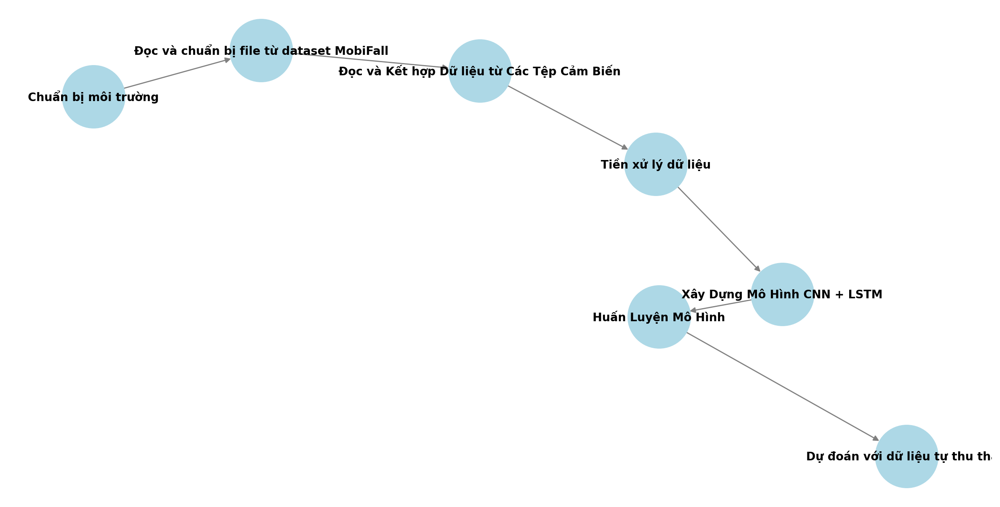

<h1 align="center">DỰ ĐOÁN RỦI RO TÉ NGÃ NGƯỜI CAO TUỔI DỰA TRÊN CẢM BIẾN ĐEO TAY</h1>

  
    

<h2 align="center">Sử dụng mô hình CNN +LSTM để dự đoán rủi ro té ngã ở người cao tuổi</h2>

Sử dụng mô hình CNN + LSTM để dự đoán rủi ro té ngã ở người cao tuổi" nhằm ứng dụng trí tuệ nhân tạo để dự đoán nguy cơ té ngã, một vấn đề nghiêm trọng đối với người cao tuổi. Kết hợp giữa mạng CNN để trích xuất đặc trưng hình ảnh và LSTM để phân tích chuỗi thời gian, mô hình này giúp nhận diện sớm các dấu hiệu nguy hiểm, từ đó nâng cao hiệu quả trong việc giám sát và phòng ngừa té ngã, bảo vệ sức khỏe người cao tuổi.

---

## 🌟 Giới thiệu
Đề tài này tập trung vào việc sử dụng dữ liệu gia tốc để dự đoán rủi ro té ngã, một vấn đề quan trọng đối với người cao tuổi nói riêng và cộng đồng nói chung. Việc phân tích dữ liệu gia tốc giúp nhận diện các hành vi và chuyển động nguy hiểm, từ đó đưa ra cảnh báo sớm, giảm thiểu nguy cơ té ngã và bảo vệ sức khỏe cho tất cả mọi người---
## 🏗️ HỆ THỐNG

  

---

## 🛠️ CÔNG NGHỆ SỬ DỤNG

  

##  Yêu cầu hệ thống
1. Yêu cầu phần cứng
- Máy tính có GPU mạnh mẽ (NVIDIA với CUDA hoặc tương đương): Để huấn luyện mô hình học sâu CNN và LSTM hiệu quả.
   
- Dung lượng bộ nhớ RAM lớn: Tối thiểu 16GB (hoặc cao hơn nếu xử lý dữ liệu lớn hoặc mô hình phức tạp).
   
- Ổ cứng SSD: Để lưu trữ dữ liệu huấn luyện và mô hình.
   
Cảm biến gia tốc (accelerometer): Để thu thập dữ liệu chuyển động từ người cao tuổi. Các thiết bị như smartphone hoặc thiết bị đeo có cảm biến gia tốc có thể được sử dụng.
 
2. Yêu cầu phần mềm
 
Hệ điều hành: Linux hoặc Windows (Linux được ưa chuộng trong việc triển khai AI).
 
Các thư viện AI và Deep Learning:
 
TensorFlow/Keras hoặc PyTorch: Các thư viện này hỗ trợ xây dựng và huấn luyện mô hình CNN và LSTM.

## 🚀 Hướng dẫn cài đặt và chạy

 ## Bước 1:  Chuẩn bị môi trường
## Bước 2: Đọc và chuẩn bị file từ dataset MobiFall
   
  ## Bước 3: Đọc và kết hợp dữ liệu từ các tệp cảm biến
   
  ## Bước 4:Tiền xử lý dữ liệu
   
  ## Bước 5:  Xây dựng mô hình CNN + LSTM

  ## Bước 6: Huấn luyện mô hình
  ## Bước 7: Dự đoán với dữ liệu tự thu thập
  ## Bước 8: Lưu và tải lại mô hình
   
   

## 🤝 Đóng góp
Dự án được phát triển bởi 3 thành viên:

| Họ và Tên                | Vai trò                  |
|--------------------------|--------------------------|
| Vương Đức Tuấn             | Phát triển toàn bộ mã nguồn,thuyết trình|
| Vũ Quang Trường            | Overleaf,,Powerpoint, .|
| Lỗ Văn Tuấn    | Hỗ trợ bài tập lớn.  |

© 2025 NHÓM 2, CNTT 17-15, TRƯỜNG ĐẠI HỌC ĐẠI NAM
